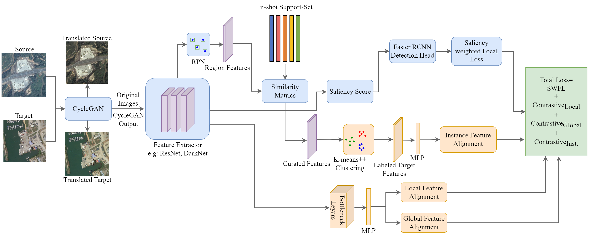
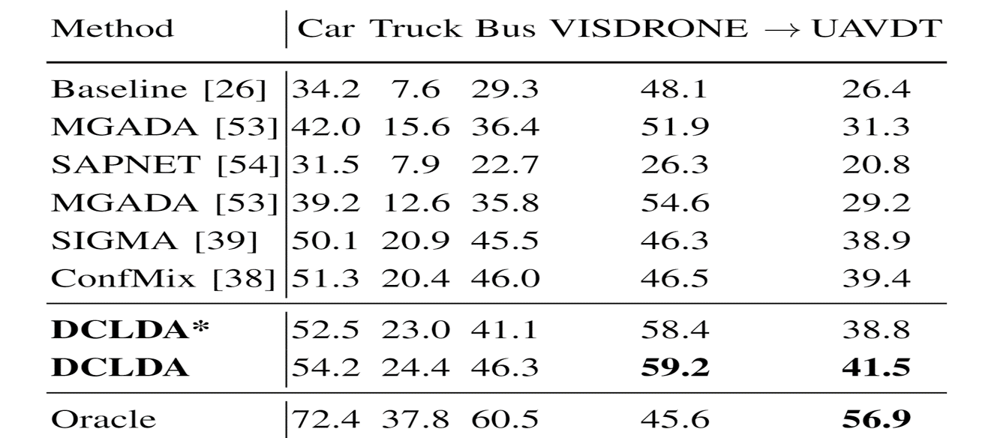

# DCLDA
IEEE JSTAR 2024 code 

## Installation

1. Create and activate a new conda enviroment (Recommended to use Python>=3.9)
2. Install pytorch & cuda from [official website](https://pytorch.org/get-started/locally/)<br />
**Note:** It is recommended to install CUDA version >= 11.0
3. Clone the repository in local
```bash
$ cd DCLDA
$ python -m pip install -e CenterNet2
$ cd CenterNet2
$ pip install -r requirements.txt
```

## Architecture



## Train

train_net.py allows you to train new model from strach.
```bash
$ cd /home/username/aerialAdaptation/CenterNet2/projects/CenterNet2
$ python train_net_multi_datasets_Satellite.py for DIOR to DOTA dataset UDA training
$ python train_net_multi_datasets_UAV.py for Vsidrone to UAVDT dataset UDA training 
```

## Validation

validation.py allows you to run inference on trained a model. User need to provide the annotations(COCO json format) and images
```bash
$ cd /home/username/aerialAdaptation/CenterNet2/projects/CenterNet2
$ python validation.py for all dataset inference
```


## Experimental Results
The overall and classwise performance considering DIOR as the source and DOTA as the target dataset is provided below:

<div align="center">

</div>

The overall and classwise performance considering VISDRONE as the source and UAVDT as the target dataset is provided below:

<div align="center">

</div>

## License

Our code repository is under [Apache 2.0 license](/LICENSE). Codes Under projects/CenterNet2 are also under [Apache 2.0 license (/LICENSE).`projects/CenterNet2/centernet/modeling/backbone/bifpn_fcos.py` are from [AdelaiDet](https://github.com/aim-uofa/AdelaiDet), which follows the original [non-commercial license](https://github.com/aim-uofa/AdelaiDet/blob/master/LICENSE). The code from detectron2 follows the original [Apache 2.0 license](LICENSE).

## Citation

If you find this project useful for your research, please use the following BibTeX entry.
    @article{biswas2024unsupervised,
      title={Unsupervised domain adaptation with debiased contrastive learning and support-set guided pseudo labeling for remote sensing images},
      author={Biswas, Debojyoti and Te{\v{s}}i{\'c}, Jelena},
      journal={IEEE Journal of Selected Topics in Applied Earth Observations and Remote Sensing},
      year={2024},
      publisher={IEEE}
    }
    @inproceedings{zhou2021probablistic,
      title={Probabilistic two-stage detection},
      author={Zhou, Xingyi and Koltun, Vladlen and Kr{\"a}henb{\"u}hl, Philipp},
      booktitle={arXiv preprint arXiv:2103.07461},
      year={2021}
    }
