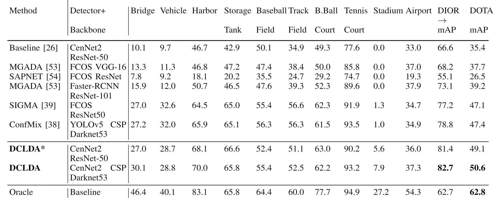

# DCLDA
IEEE JSTAR 2024 code 

# Installation

1. Create and activate a new conda enviroment (Recommended to use Python>=3.9)
2. Install pytorch & cuda from [official website](https://pytorch.org/get-started/locally/)<br />
**Note:** It is recommended to install CUDA version >= 11.0
3. Clone the repository in local
```bash
$ cd APLDA
$ python -m pip install -e CenterNet2
$ cd CenterNet2
$ pip install -r requirements.txt
```

# Architecture


# Train

train_net.py allows you to train new model from strach.
```bash
$ cd /home/username/aerialAdaptation/CenterNet2/projects/CenterNet2
$ python train_net_multi_datasets_Satellite.py for DIOR to DOTA dataset UDA training
$ python train_net_multi_datasets_UAV.py for Vsidrone to UAVDT dataset UDA training 
```

# Validation

validation.py allows you to run inference on trained a model. User need to provide the annotations(COCO json format) and images
```bash
$ cd /home/username/aerialAdaptation/CenterNet2/projects/CenterNet2
$ python validation.py for all dataset inference
```


# Experimental Results
The overall and classwise performance considering DIOR as the source and DOTA as the target dataset is provided below:

<div align="center">

</div>

The overall and classwise performance considering VISDRONE as the source and UAVDT as the target dataset is provided below:

<div align="center">

</div>
